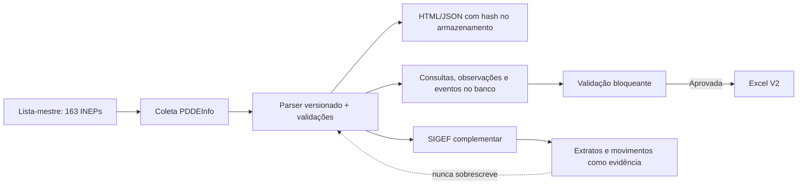

# Análise Geral do Projeto — Extrator Financeiro PDDEInfo · 4ª CRE

**Data da revisão:** 14 de agosto de 2026  
**Autor:** Manus AI  
**Escopo:** arquitetura, integridade de dados, coleta PDDEInfo/SIGEF, persistência, segurança, testes, operação, documentação e interface.  
**Método:** leitura de código e schema, inspeção de execuções persistidas, revisão independente, validação de testes/tipagem/build, auditoria de dependências e inspeção visual. Nenhuma nova consulta externa foi disparada para esta análise.

## Síntese executiva

O projeto está **funcional, coerente com sua finalidade institucional e tecnicamente acima da média para um extrator operacional de dados públicos**. O desenho de negócio é particularmente sólido: o PDDEInfo continua sendo a fonte primária; o SIGEF é complementar; a conta do PDDE Básico só é aceita com rótulo exato `PDDE`; CAPTCHA não é contornado; e o Excel só é liberado após controles bloqueantes. O conjunto de evidências por campo, hashes, artefatos preservados e histórico imutável oferece uma base de rastreabilidade efetiva.

O principal risco atual não está na semântica financeira, mas na **maturidade de operação segura sob carga, reinício e múltiplos usuários**. Há quatro prioridades: proteger o proxy de armazenamento, restringir o acesso por proprietário ou perfil, retirar o estado de execução da memória do processo e corrigir vulnerabilidades transitivas reportadas pela auditoria de dependências. Esses pontos devem preceder qualquer expansão agressiva de lotes SIGEF ou de novas fontes.

| Dimensão | Situação | Leitura técnica |
|---|---|---|
| Regras financeiras e de fonte | Forte | Salvaguardas explícitas e conservadoras; sem inferência bancária indevida. |
| Rastreabilidade e evidências | Forte | Hashes, HTML/XLS/JSON, observações por campo e eventos persistidos. |
| Validação e Excel | Forte | Bloqueios de cobertura, semântica, schema e histórico antes da liberação. |
| Testes e compilação | Boa | 101 testes aprovados, tipagem estrita e build aprovados; faltam gates de cobertura e cenários reais de infraestrutura. |
| Resiliência operacional | Moderada | Execução depende de memória do processo e SSE; há execuções históricas ainda marcadas como `running`. |
| Segurança de acesso e artefatos | Prioridade alta | Proxy de armazenamento sem autenticação e ausência de escopo por execução. |
| Dependências | Prioridade alta | Auditoria identificou 36 vulnerabilidades de produção, incluindo 2 de severidade alta. |
| Interface operacional | Boa | Auditoria restabelecida em PDDEInfo; ainda há acoplamento de estado e discrepância visual entre telas. |

## Arquitetura observada

O sistema é uma aplicação React, Express, tRPC e Drizzle/MySQL/TiDB. A coleta PDDEInfo é organizada por execução, consulta 163 INEPs em grupos de três, persiste a resposta bruta e o registro normalizado em armazenamento de objetos e grava a trilha de auditoria no banco. O Excel V2 é gerado somente depois de validações bloqueantes. Os adaptadores SIGEF operam como fonte externa complementar, preservando identidade, exportação integral, JSON e hash, mas sem preencher os campos primários extraídos do PDDEInfo.

| Camada | Componentes principais | Avaliação |
|---|---|---|
| Domínio | `parser.ts`, `semantics.ts`, `reconciliation*.ts`, `workbook.ts` | Boa separação das regras financeiras críticas. |
| Orquestração | `run.ts`, pilotos SIGEF, planos de coleta | Funcional, porém concentra execução longa no processo HTTP. |
| Persistência | `drizzle/schema.ts`, `db.ts`, armazenamento de objetos | Rica em metadados e índices básicos; sem chaves estrangeiras e com alguns caminhos de atualização a reforçar. |
| API e acesso | `routes.ts`, `access.ts`, OAuth/tRPC | Autenticação presente; autorização por recurso insuficiente. |
| Interface | `Home.tsx`, `Audit.tsx`, auxiliares e CSS | Institucional e informativa; componentes grandes concentram estado, rede e renderização. |

## Pontos fortes confirmados

### Semântica financeira e controles de fonte

O parser preserva valores como texto onde isso evita perda de informação, como agência e conta. A regra de vínculo bancário é corretamente restritiva: `accountForExactProgram` compara o programa normalizado por igualdade, impedindo que `PDDE QUALIDADE` ou `PDDE EQUIDADE` preencham a conta do PDDE Básico. A classificação de programas e destinações falha de forma bloqueante quando encontra rótulo desconhecido ou ambíguo, o que é adequado para prestação de contas.

O catálogo de fontes diferencia explicitamente o que é autônomo, o que requer autorização e o que tem CAPTCHA. O adaptador SIGEF de extrato restringe programa, banco, conta declarada e exercícios de 2025–2026, preservando o arquivo integral e impedindo conciliação quando a cobertura não é íntegra. Essa postura reduz o risco de transformar lacunas de fonte em conclusões financeiras.

### Rastreabilidade, imutabilidade e evidência

O schema persiste execução, consulta escolar, artefatos, achados, observações por campo e eventos de auditoria. O desenho append-only de observações e eventos é correto para o propósito: explicações posteriores não apagam a fonte original. A coleta guarda URL, data, hash SHA-256, seletor, regra de extração, valor bruto, valor normalizado e resultado de validação por campo. É uma base adequada para auditoria posterior e contestação técnica.

### Liberação controlada do Excel

O gerador mantém as duas abas exigidas — `Financeiro 4ª CRE V2` e `Validação V2` — e bloqueia a saída quando falham cobertura, unicidade, consultas, schema, semântica financeira, histórico ou parâmetros críticos do exercício. A observação “pagamento registrado no PDDEInfo” permanece corretamente distinta de crédito bancário confirmado.

### Cobertura de testes e verificação de build

A revisão executou `pnpm test`, `pnpm check` e `pnpm build` com sucesso. A suíte possui **101 testes** distribuídos em parser, semântica, reconciliação, rotas, recuperação, fontes, pilotos SIGEF e auxiliares da auditoria. Também foram realizadas verificações visuais da execução e da auditoria; a referência PDDEInfo aprovada continua visível como fonte primária, enquanto a cobertura SIGEF aparece separadamente como 20/163 UEx.

## Estado operacional observado

Há uma execução PDDEInfo aprovada de 163/163 escolas (`14fe09f3-a1cb-4ff7-bb05-fc1089849f72`). Os lotes SIGEF complementares preservaram evidência para 20 UEx; o segundo lote de 15 UEx foi corretamente registrado como inconclusivo após timeout SSL da fonte, sem gerar inferência ou sobrescrever dados primários.

Também foram identificadas execuções históricas ainda com status `running`, incluindo uma com 159/163 escolas processadas e duas sem progresso. Isso não invalida a execução aprovada, mas confirma que o ciclo de encerramento de execuções interrompidas precisa ser mais robusto e independente do acesso posterior de uma tela.

| Elemento | Estado | Implicação |
|---|---|---|
| Execução PDDEInfo aprovada | 163/163 | Base primária íntegra e apta à consulta e ao Excel. |
| Cobertura SIGEF efetiva | 20/163 | Evidência complementar parcial; não é cobertura financeira completa. |
| Segundo lote SIGEF | 15 consultas inconclusivas | Indisponibilidade externa registrada corretamente; não deve ser tratado como ausência de crédito. |
| Execuções antigas `running` | Encontradas | Indica necessidade de mecanismo de expiração e recuperação transacional. |

## Achados priorizados

| Prioridade | Achado | Evidência técnica | Impacto | Recomendação objetiva |
|---|---|---|---|---|
| **P0** | Proxy de armazenamento sem autenticação e sem lista de prefixos permitidos | `server/_core/storageProxy.ts` aceita qualquer chave em `/manus-storage/*` e redireciona para URL assinada | Um terceiro que conheça ou obtenha uma chave pode solicitar acesso a artefatos; não há barreira de sessão na rota. | Exigir sessão e autorização antes de assinar a URL; validar prefixos `evidence/pdde-4cre/` e `exports/pdde-4cre/`; negar caminhos fora do escopo. |
| **P0** | Acesso a execuções não é vinculado ao proprietário nem a papel administrativo | Rotas de auditoria recebem `runId`; as execuções armazenam `createdByUserId`, mas a autorização não aplica ownership/RBAC por recurso | Usuários autenticados podem consultar execuções de terceiros se conhecem o identificador. | Criar `adminProcedure` ou `assertRunAccess(runId, user)` e aplicá-lo a overview, escolas, dossiê, achados, artefatos e importações. |
| **P1** | Estado ativo de coleta depende de `Map` em memória | `activeRuns` em `run.ts`; SSE e recuperação em `Home.tsx` | Reinício, troca de instância ou escala horizontal podem perder o trabalhador ativo e deixar execução incoerente. | Tornar banco/fila a fonte de verdade; usar worker, heartbeat, lock por execução e eventos persistidos. |
| **P1** | Encerramento de `running` pode ocorrer por observação do status, sem TTL transacional | Rotas de recuperação e execuções históricas `running` | Uma instância sem o `Map` pode classificar prematuramente trabalho que continua em outra instância. | Aplicar compare-and-set: somente encerrar se heartbeat estiver vencido; registrar `workerId`, `heartbeatAt` e motivo de interrupção. |
| **P1** | Auditoria de dependências encontrou 36 vulnerabilidades em produção, 2 altas | `pnpm audit --prod` | O risco é sobretudo transitivo, mas precisa de triagem e atualização controlada antes de crescimento do uso. | Atualizar/remover `streamdown`, `mermaid`, `recharts` ou fixar `overrides` após testes; instituir auditoria no CI. |
| **P2** | Validações do Excel usam totais fixos do recorte 2026 | `workbook.ts` espera 163, 111, 163 e 47 | É seguro para o corte atual, mas bloqueia evolução de exercício, lista ou regra sem mudança de código. | Mover expectativas para perfil versionado de exercício/lista, assinado e exibido na auditoria. |
| **P2** | Limites externos são locais ao processo, sem circuit breaker global | `run.ts`, pilotos SIGEF e plano de coleta | Múltiplas execuções podem somar requisições e agravar indisponibilidade da fonte. | Adicionar semáforo por host, cooldown por falhas consecutivas e fila de retentativa de UEx inconclusivas. |
| **P2** | Modelo relacional não impõe integridade referencial no banco | Tabelas usam `runId` e `inep` indexados, sem foreign keys | A aplicação controla as relações, mas artefatos ou observações órfãs podem surgir após falhas parciais. | Avaliar FKs não destrutivas ou validação transacional de criação; incluir rotina de integridade somente-leitura. |
| **P2** | Componentes de tela concentram estado, rede e renderização | `Audit.tsx` e `Home.tsx` reúnem fetch, retry, seleção, transformação e UI | Aumenta risco de regressão, como a priorização temporária da execução SIGEF parcial. | Extrair hooks de dados, componentes de referência e tabelas; manter regras puras testadas em módulos auxiliares. |
| **P3** | Ausência de gate de cobertura e de testes de UI no navegador | `vitest.config.ts` usa ambiente Node e não define `coverage` | Os contratos de domínio são bem testados, mas fluxos visuais e acesso real ao banco não têm barreira automática. | Exigir cobertura mínima para módulos críticos; adicionar smoke de migração e testes de fluxo autenticado/seleção de execução. |
| **P3** | Recuperação visual pode exibir erro de estado persistido antigo | Captura de `/` e `ANALISE_VISUAL_PROJETO_2026_08_14.md` | Pode induzir o operador a pensar que não há execução recuperável. | Limpar chave local obsoleta e oferecer ação “Abrir última execução aprovada” antes de exibir erro. |

## Segurança e privacidade

O projeto não contorna CAPTCHA e preserva separação de fontes, duas decisões corretas. O risco prioritário está no perímetro interno da própria aplicação. OAuth autentica a sessão, mas autenticação não equivale a autorização por recurso; o sistema deve explicitar quem pode ver qual execução e qual artefato. A existência de `createdByUserId` fornece base técnica para essa evolução.

O `express.json({ limit: "50mb" })` é aplicado globalmente antes das rotas. Embora possa ser necessário para importações autorizadas, amplia o consumo potencial de memória em endpoints que não precisam de corpo grande. A recomendação é reduzir o limite global e aplicar um limite maior, com validação de tipo e tamanho, somente na rota de importação de dados abertos.

As vulnerabilidades de dependências são transitivas e não demonstram exploração no projeto. Mesmo assim, dependências de visualização e Markdown podem aumentar o risco de XSS ou injeção quando dados externos ou rich text forem incorporados. As duas vulnerabilidades altas reportadas estão no ecossistema `lodash` transitivo de `streamdown/mermaid` e `recharts`; a atualização deve ser testada em branch antes de publicação. [1] [2]

## Qualidade, manutenção e documentação

O repositório tem uma documentação de continuidade, contratos de fonte, resultados de lotes e registros de validação. Essa é uma força importante: decisões já tomadas podem ser retomadas sem depender de memória de conversa. O backlog `todo.md` também preserva histórico em vez de apagar itens concluídos.

Como contrapartida, o projeto acumula documentos pontuais e componentes grandes. A manutenção futura será mais simples se os registros de execução seguirem um modelo padronizado — `decisão`, `escopo`, `resultado`, `limites`, `artefatos`, `próxima ação` — e se os módulos de tela forem fracionados. Não há dívida crítica de estilo ou tipagem: `strict` está ativo, o build é reproduzível e não foram encontrados conflitos no diff.

## Roteiro recomendado

### Etapa 1 — Antes de ampliar lotes ou usuários

Corrigir o proxy de armazenamento e aplicar autorização por execução. Em seguida, atualizar as dependências vulneráveis ou eliminar dependências não usadas. Essas três ações reduzem superfície de exposição sem mudar a lógica financeira.

### Etapa 2 — Tornar a coleta resiliente

Persistir heartbeat e lock de execução no banco, remover o `Map` como fonte de verdade e impedir que uma consulta de status encerre trabalho de outra instância. Criar uma fila de reconsulta para as UEx SIGEF inconclusivas, com limite global por host e circuito de pausa quando a fonte falhar repetidamente.

### Etapa 3 — Preparar evolução de exercício e operação continuada

Versionar as expectativas de validação por ano e lista-mestre, mantendo o perfil 2026 atual como baseline imutável. Extrair hooks e componentes da auditoria, adicionar cobertura de UI e teste de migração/integração com banco. O indicador SIGEF deve continuar medindo somente INEPs com evidência efetivamente preservada.

### Etapa 4 — Melhorar clareza operacional

Unificar a moldura visual de execução e auditoria, explicitar carregamentos assíncronos e melhorar a recuperação de estado local. Essas melhorias têm impacto direto na confiança do operador, mas devem ocorrer depois das correções de segurança e execução persistente.

## Conclusão

O sistema já entrega o essencial: uma base PDDEInfo íntegra de 163 escolas, um Excel bloqueado por validações, uma trilha auditável por campo e integração SIGEF complementar sem confundir fonte, conta ou crédito. Portanto, o projeto está em condição de continuar sendo usado como ferramenta institucional de análise e prestação de contas.

O próximo salto não é adicionar mais telas ou fontes: é fortalecer o perímetro de acesso, tornar o processamento independente de uma instância HTTP e resolver a higiene de dependências. Com essas correções, a expansão gradual dos lotes SIGEF poderá ocorrer com menor risco operacional e maior confiança na continuidade do histórico.

## Referências

[1]: https://github.com/advisories/GHSA-r5fr-rjxr-66jc "GHSA-r5fr-rjxr-66jc — lodash code injection"
[2]: https://github.com/advisories/GHSA-55q2-fjhq-7xh7 "GHSA-55q2-fjhq-7xh7 — DOMPurify vulnerability"
